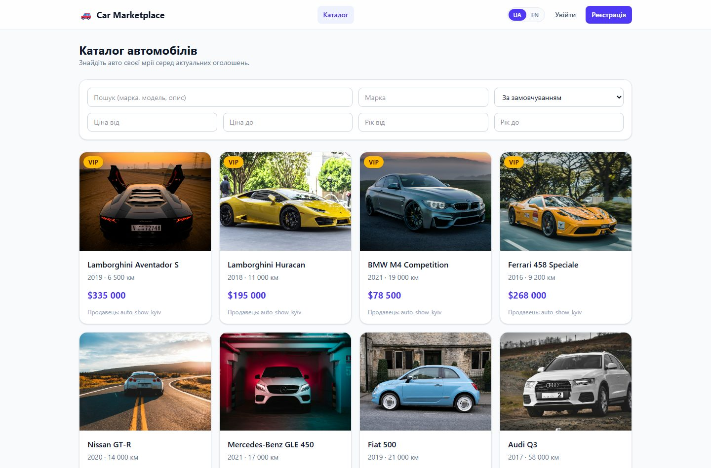
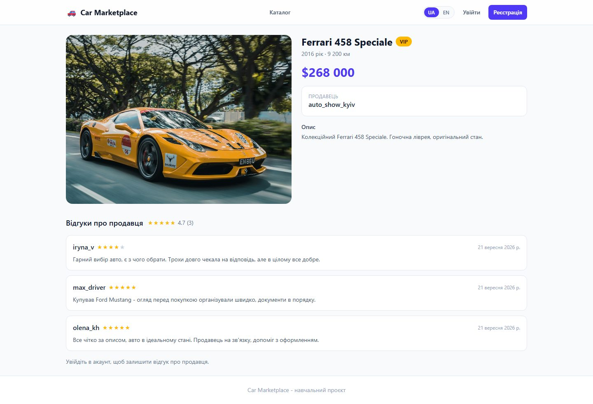
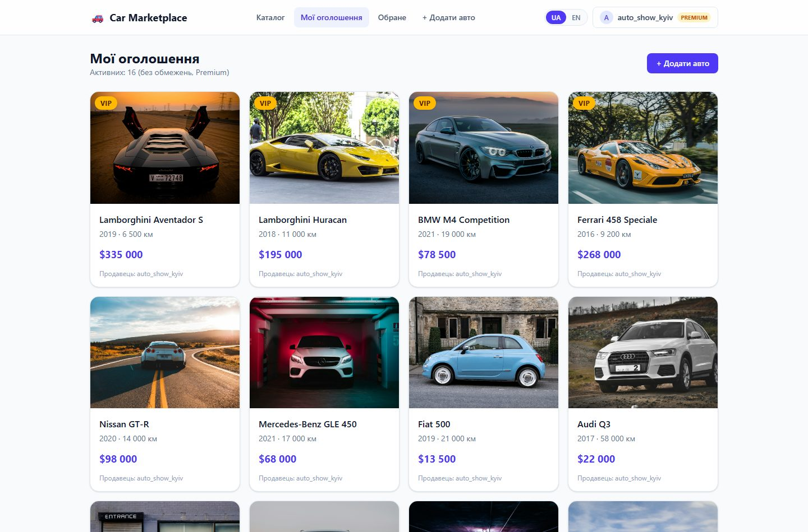
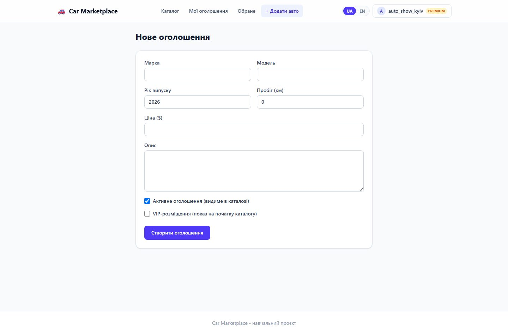
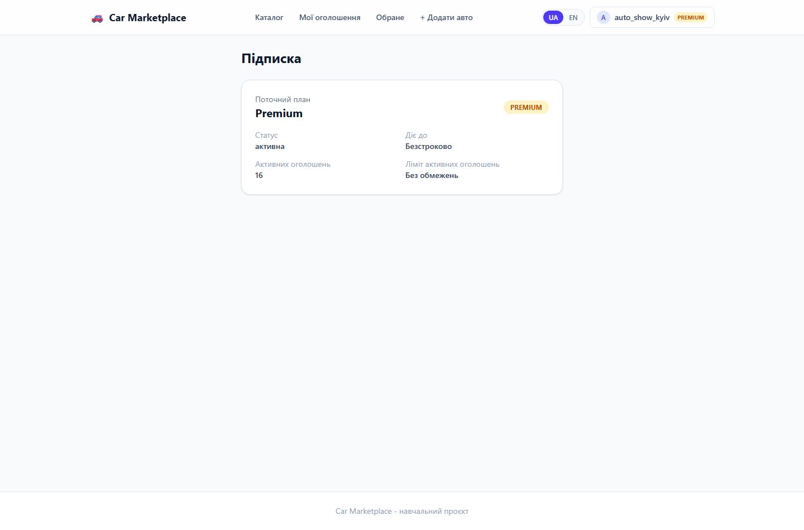

# 🚗 Car Marketplace

A full-stack car classifieds platform: browse and search listings, manage your own ads with photo galleries, favorite cars, rate sellers, and upgrade to a Premium plan for unlimited and VIP listings.

Built as a Django REST API backend paired with a React + TypeScript single-page frontend.



## Features

- **Catalog** - search, filter by brand/price/year, sort, pagination, VIP listings pinned to the top
- **Auth** - JWT-based registration and login with automatic access-token refresh
- **Listings** - create, edit, deactivate and delete your own car ads; one active listing on the Free plan, unlimited on Premium
- **Photos** - upload multiple photos per car, pick a main photo, instant upload preview
- **Favorites** - save listings from the catalog or a car's detail page
- **Seller reviews** - 1-5 star ratings with comments, aggregated into an average rating on the seller's profile
- **Profile** - phone, city, avatar, seller rating
- **Premium subscription** - Stripe Checkout integration plus a no-payment demo activation endpoint for testing
- **Bilingual UI** - Ukrainian and English, switchable from the navbar, persisted per browser
- **Responsive** - works down to a 360px-wide phone screen

## Screenshots

| Catalog | Listing details & reviews |
|---|---|
|  |  |

| Managing your listings | Creating a listing |
|---|---|
|  |  |

| Subscription | Mobile view |
|---|---|
|  |  |

## Tech stack

**Backend** - `back-end/`
- Django 5 + Django REST Framework
- SimpleJWT (access/refresh authentication)
- django-filter, drf-spectacular (OpenAPI schema + Swagger UI)
- Stripe for subscription checkout
- SQLite (default), Docker + docker-compose for containerized runs

**Frontend** - `front-end/`
- React 19 + TypeScript, built with Vite
- React Router for client-side routing
- TanStack Query for server-state caching
- Axios with a JWT refresh interceptor
- Tailwind CSS v4
- A small custom i18n layer (UK/EN) - no external i18n library

## Project structure

```
.
├── back-end/            Django + DRF API
│   ├── car_marketplace/  settings, URLs
│   ├── listings/         cars, images, favorites, reviews, profile
│   └── subscriptions/    Stripe checkout, webhook, demo activation
├── front-end/            React + TypeScript SPA
│   └── src/
│       ├── api/           one module per backend resource
│       ├── components/    shared UI building blocks
│       ├── context/       auth session state
│       ├── hooks/         data-fetching hooks (profile, favorites, subscription, ...)
│       ├── i18n/          translations + language context
│       ├── lib/           axios client, formatting helpers
│       └── pages/         one component per route
└── docs/screenshots/     images used in this README
```

## Getting started

### Backend (Docker)

Requires Docker Desktop.

```bash
cd back-end
cp .env.example .env      # fill in Stripe keys if you want real checkout - optional
docker compose up --build
```

The API is now live at `http://127.0.0.1:8000`. Interactive docs: `http://127.0.0.1:8000/api/schema/swagger-ui/`.

<details>
<summary>Running the backend without Docker</summary>

```bash
cd back-end
python -m venv .venv
source .venv/bin/activate      # Windows: .venv\Scripts\activate
pip install -r requirements.txt
cp .env.example .env
python manage.py migrate
python manage.py runserver
```
</details>

### Frontend

Requires Node.js 20+.

```bash
cd front-end
npm install
cp .env.example .env.local
npm run dev
```

Open `http://localhost:5173`. It expects the API at `http://localhost:8000/api` by default (configurable via `VITE_API_BASE_URL` in `.env.local`).

### Environment variables

**`back-end/.env`**

| Variable | Purpose | Required |
|---|---|---|
| `STRIPE_SECRET_KEY`, `STRIPE_PUBLISHABLE_KEY`, `STRIPE_PRICE_ID`, `STRIPE_WEBHOOK_SECRET` | Real Stripe Checkout | No - omit to get a clean 503 from checkout; use the demo-activation button instead |
| `CORS_ALLOWED_ORIGINS` | Origins allowed to call the API | No - defaults to `localhost:5173`/`5174` in debug mode |
| `FRONTEND_URL` | Where Stripe success/cancel pages link back to | No - defaults to `http://localhost:5173` |

**`front-end/.env.local`**

| Variable | Purpose |
|---|---|
| `VITE_API_BASE_URL` | Base URL of the backend API |

## API documentation

The full API contract is generated from the code and served live once the backend is running:

- OpenAPI schema: `GET /api/schema/`
- Swagger UI: `GET /api/schema/swagger-ui/`

## License

MIT - see [LICENSE](LICENSE).
